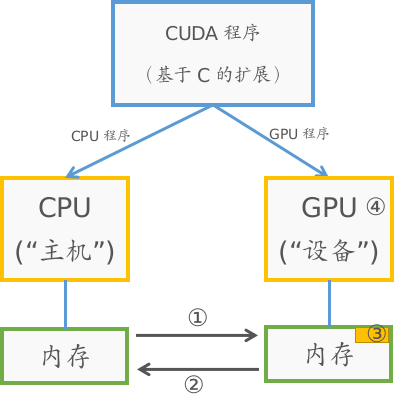
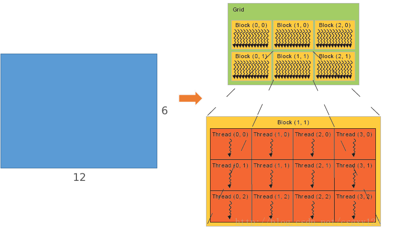

# CUDA基础

## 1. 处理器的发展

提高处理器处理能力的方法：

1. 更快的时钟
2. 每个时钟周期进行更多工作
3. 更多处理器（GPU采用的方式）

目前发展趋势：

① 晶体管的尺寸依旧能保持逐年减小，因此能够集成更多的晶体管

② 时钟速度遇到了瓶颈：主要是由于约十亿个传输器的运转将产生巨大的热量，从而无法让处理器保持冷却状态。（电力上的瓶颈）

因此：虽然我们有更多的晶体管用于计算，但我们的时钟速度并没有变快。


CPU的特点：让每个时钟周期做更多的工作

GPU的特点：将问题分成多块，同时运行这些小块

两者在优化目标上面不同，在功耗一定的情况下：CPU优化执行时间，即优化每个具体任务的时间。GPU优化吞吐量，即一段时间内完成的工作量。

## 2. GPU设计特点

1. 有很多简单的计算单元，他们在一起可以执行大量的计算。通过牺牲控制来交换计算，即更简单的控制和更多的计算能力
2. 有一个显示并行编程模型，有很多处理器，因此要站在并行的角度进行编程
3. GPU是为吞吐量进行优化，而非延误。因此只有在吞吐量是主要目标时，GPU才是更好的选择

## 3. CUDA程序的特点



1. CUDA编译器将程序分成在CPU和GPU上运行的部分，为各自生成代码
2. CUDA假设设备GPU是主机CPU的协同处理器，还假设主机和设备有各自分开的内存
3. CPU处于主导地位，运行主程序，向GPU发送指示从而指导其做什么

图中①～④的含义：

① 数据从 CPU到GPU  :  CudaMemcpy

② 数据从 GPU到CPU  :  CudaMemcpy

③ 分配GPU内存（Allocate GPU Memory）

④ 在GPU上启动内核（launch kernel on GPU）

注：内核可以理解为执行“重复任务”中的“单个任务”的代码，分配的线程中的每个线程均运行此内核。

### 典型的CUDA程序的执行步骤

① CPU在GPU上分配内存（cudaMalloc）

② CPU将数据从CPU的内存复制到GPU的内存上（cudaMemcpy）

③ CPU启动内核，令GPU处理这些数据（kernel launch）

④ CPU将数据从GPU的内存复制回CPU的内存上（cudaMemcpy）

注：1. 写程序时主要的思想：编写内核时，可以想象它是一个串行程序，在单个线程上运行。然后当你从CPU启动该内核时，告诉它要启动多少个线程，这些线程中的每个线程均运行此内核。

​	2. GPU的优势(特点)：① 能够高效的启动许多线程   ② 能够并行地运行多个线程

### 常用的几个函数形式

```c
// 分配size大小的线性空间，指针*devPtr指向这片空间
cudaError_t cudaMalloc(void** devPtr, size_t size)
// 从src中复制count个字节的内容到dst, 复制类型主要有两种：
// 1. cudaMemcpyHostToDevice --- 从CPU到GPU  2. cudaMemcpyDeviceToHost --- 从GPU到CPU
cudaError_t cudaMemcpy(void* dst, const void* src, size_t count, enum cudaMemcpyKind kind)
// 将devPtr空间中前count的内容赋为value
cudaError_t cudaMemset(void* devPtr, int value, size_t count)	
// 释放devPtr指向的空间
cudaError_t cudaFree(void* devPtr)
```

### 内核(kernel)

以`__global__`作为开始，下面是一个简单的每个元素平方的内核程序

```c
/* 内核程序：d_xx代表设备内存上的变量 */
__global__ void square(float* d_out, float* d_in)
{
  int idx = threadIdx.x;  // threadIdx代表线程的索引
  float f = d_in[idx];
  d_out[idx] = f*f;
}
```

可以发现其实就是想成单个元素的操作，再引入线程。

**调用内核的方式：**

```c
内核程序<<<块的数目，每个块的线程数目>>>(内核程序的输入参数)
// 例如单个块, 64个线程情况下调用上述内核
square<<<1, 64>>>(d_out, d_in)
```

注：其中***块的数目***和***每个块的线程数目***常规表述为三维的：`dim3(x,y,z)`

### 块和线程数的关系

以 `GridOfBlocks=dim3(3,2,1)`和`BlockOfThreads=dim3(4,3,1)`为例，下图就代表这两者的关系(一张12x6的图)：



注：1. 即一个块可以包含多个线程，在第二部分会介绍流处理器，一个流处理器又包含多个块。

​	2. 每个线程均知道自己所在的块和在块上的索引(即知道在Grid和Block上的索引)

说明：① `blockIdx.x, blockIdx.y, blockIdx.z`代表Grid中的`x,y,z`坐标(单个块为1)  ② `blockDim.x, blockDim.y, blockDim.z=GridOfBlocks`中的维度，如上图情况为`2,3,1`  ③ `threadIdx.x, threadIdx.y`则代表在单个块中的坐标

## 4. CUDA示例程序

```c
// 数组每个元素进行平方操作程序
#include <stdio.h>
/* --------------------内核程序----------------------*/
__global__ void square(float* d_out, float* d_in)
{
  int idx = threadIdx.x;  // threadIdx代表线程的索引
  float f = d_in[idx];
  d_out[idx] = f*f;
}
/* -------------------主程序------------------------*/
int main(int argc, char** argv)
{
  const int ARRAY_SIZE = 64;
  const int ARRAY_BYTES = ARRAY_SIZE * sizeof(float);
  // 在主机(host---CPU的内存)上存储数据
  float h_in[ARRAY_SIZE];
  for (int i=0; i<ARRAY_SIZE; i++)
  {
  	h_in[i] = float(i);    
  }
  float h_out[ARRAY_SIZE];
  
  // 定义指向GPU内存的指针
  float* d_in;
  float* d_out;
  // 1. 分配GPU内存
  cudaMalloc((void**) &d_in, ARRAY_BYTES);
  cudaMalloc((void**) &d_out, ARRAY_BYTES);
  // 2. 将数据从CPU内存复制到GPU内存上
  cudaMemcpy(d_in, h_in, ARRAY_BYTES, cudaMemcpyHostToDevice);
  // 3. 启动内核
  square<<<1, ARRAY_SIZE>>>(d_out, d_in);
  // 4. 将数据从GPU内存复制回CPU内存上
  cudaMemcpy(h_out, d_out, ARRAY_BYTES, cudaMemcpyDeviceToHost);
  
  // 显示结果
  for (int i=0; i<ARRAY_SIZE; i++)
  {
  	printf("%f", h_out[i]);
    printf(((i%4)!=3)? "\t": "\n");
  }
  // 释放GPU内存
  cudaFree(d_in);
  cudaFree(d_out);
  return 0
}
```

