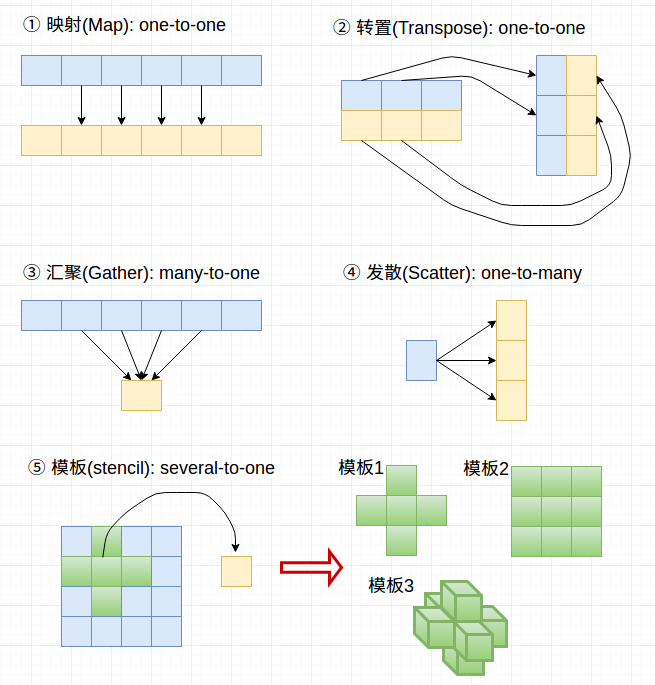
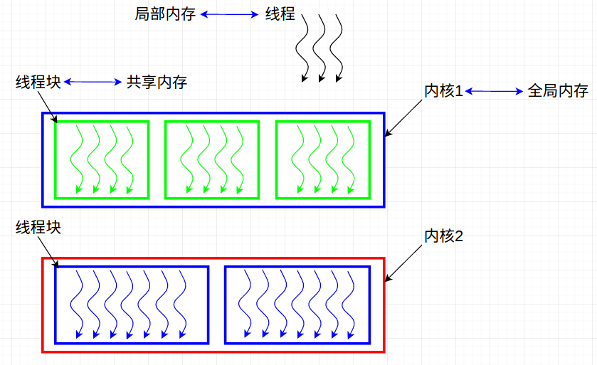
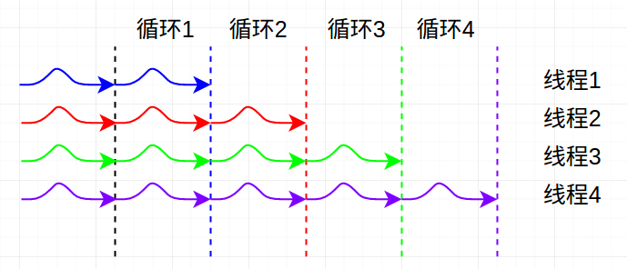

# GPU硬件和几种常用并行通信模式

## 1. 并行通信模式

并行计算：多线程通过**_协同工作_**来解决问题（往往体现在内存上）

### 常见并行通信模式



说明：

1. 其中的(many-to-one以及one-to-many)图中只展示了单个情况，平移过去依旧能产生一系列的结果，即操作是针对整个图像的
2. 模板操作也是，不仅仅只针对这块，每个位置是有重复被使用的。（模板1：二维冯诺依曼模板,   模板2：二维摩尔模板， 模板3：三维冯诺依曼模板   --- 这三个仅仅只是实例模板，有一些其他模板）。
3. 还有几种非常常见的通信方式：reduce, scan/sort --- 具体见下一章节
4. 下面给出`demo.cu`：这些方式的简单实例（100的数组: 在transpose中视为10x10的矩阵），具体代码见文件

```c
/* map:one-to-one */
__global__ void map(float *out, float *in) {
    int i = threadIdx.x;
    const float pi = 3.1415;
    out[i] = pi * in[i];
}
/* transpose: one-to-one */
__global__ void transpose(float *out, float *in) {
    int i = threadIdx.x;
    int j = threadIdx.y;
    out[i + j * 10] = in[j + i * 10];
}
/* gather: many-to-one */
__global__ void gather(float *out, float *in) {
    int i = threadIdx.x;
    if (i % 2 && i < ARRAY_SIZE - 1) {
        out[i - 1] += in[i];
        out[i + 1] += in[i];
    }
}
/* scatter: one-to-many */
__global__ void scatter(float *out, float *in) {
    int i = threadIdx.x;
    if (i % 2 && i < ARRAY_SIZE - 1) {
        out[i] = (in[i] + in[i - 1] + in[i + 1]) / 3.0;
    }
}
```

## 2. CUDA的层次结构

### 2.1 层次结构 

计算的层次结构： 线程==>线程块==>内核

内存的层次结构： 本地==>共享内存==>全局内存

同步的层次结构：同步线程==>屏障==>隐式屏障（这部分放在2.3）



说明：

1. 内核往往是C/C++函数：通过对内核调用多线程块(每个线程块又包含多线程)来实现内核(指单内核)的并行化
2. 不同内核之间可以采用不同的线程块数目，以及每个线程块所包含的线程数（但是单个内核内部的每个线程块包含的线程数是相同的）
3. (*) 程序员主要在编写时定义线程块的大小和线程数，而GPU会在流处理器上分配对应的线程块。即程序员无需关心线程块具体是如何分配等问题
4.  ① 局部内存：每个线程专用的内存   
    ② 共享内存：线程块里面的线程之间共享
    ③ 全局内存：全部线程之间均可以共享
    访问速度： 局部内存 > 共享内存 >> 全局内存 >> CPU内存

---

Extra 1: 三种内存在程序中的表现形式（共享内存的标记`__shared__`）

``` c
__global__ void memory_GPU(float *array)
{
    float f;    // variable "f" is in local memory and private to each thread
    // "array" is a pointer into global memory on the device, 指针是局部变量, 但指向全局内存  
    array[threadIdx.x] = 2.0f * (float) threadIdx.x; 
    __shared__ float sh_arr[128];  // sha_arr指向共享内存
}
```

---

### 2.2 特点

**CUDA的特点：并不能保证每个线程块在何处以及何时执行(有很大的灵活性)**

带来的好处：

- 在硬件层面上处理非常高效：如一个线程块快速完成，则可以立马安排另一个线程块进行运算
- 可扩展性：可以下至单个流处理器，上至非常多流处理器，而无需更改内核代码

带来的限制：

- 无法指定线程块在某个特定流处理器上运行

- 无法获得块之间明确的通信，即难以明确块之间谁先完成（这一般容易导致“dead lock”现象），如下面这个实例中难以知道哪一个块先运行。

  ```c
  #include <stdio.h>

  #define NUM_BLOCKS 16
  #define BLOCK_WIDTH 1

  __global__ void hello()
  {
      printf("Hello world! I'm a thread in block %d\n", blockIdx.x);
  }

  int main(int argc,char **argv)
  {
      // launch the kernel
      hello<<<NUM_BLOCKS, BLOCK_WIDTH>>>();
      // force the printf()s to flush
      cudaDeviceSynchronize();
      printf("That's all!\n");
      return 0;
  }
  ```

CUDA能够保证的：

- 同一个线程块上的线程会同时运行在同一个流处理器上
- 一个内核上的线程块会在另一个内核的线程块启动之前全部结束

### 2.3 同步

为什么需要同步：线程可以通过共享内存和全局内存访问互相的结果，这就说明他们可以合作一起进行计算。但由于线程之间执行先后顺序未知，会存在某个线程在另一个线程写入之前读取其内容(而实际我们希望先写入之后再读取)。因此线程需要互相同步

**屏障：利用语句`__syncthreads()`**

作用：当全部线程到达该屏障时，才会继续执行。

注：另一种同步方式为”原子操作“，见下面的Extra2

## 3. 编写高效GPU程序原则

主要遵从下述两个原则：

1. 最大化算数强度
2. 避免线程发散

### 3.1 最大化算数强度

概念：单位内存上我们可以做的数学计算量 --- Math/Memory  （对应最大化每个线程的工作量和最小化每个线程在内存读取和存储上的时间消耗）

① 减少内存访问的时间

将频繁操作的数据移到更快的内存上（往往是指将全局内存移到共享内存上）

② 全局内存”紧凑化“

GPU对于连续的内存地址具有更高的读写效率，因此，尽量操作连续的内存空间

---

Extra 2：很多线程读写相同的内存位置时存在的问题及解决方法

如：1000个线程同时对长度为10的数组进行操作（+1操作），则会导致”线程可能同时读取和存储，从而导致部分线程更新”无效““。

解决方法：采用原子(atomic)操作，常见原子操作[CUDA atomic function](http://docs.nvidia.com/cuda/cuda-c-programming-guide/index.html#atomic-functions)以及对应的code

注：原子操作其实本质上也是采用将不同线程对内存访问串行化

---

### 3.2 避免线程发散

主要是由于条件语句和循环语句导致的不同线程执行时间相差较大（条件语句：不同线程进入不同的分支。  循环语句：不同线程循环次数不同）。

以循环为例：（可以看到不同线程执行的循环数目不同）



尽可能让每个线程执行的时间相近，这样效率最高。