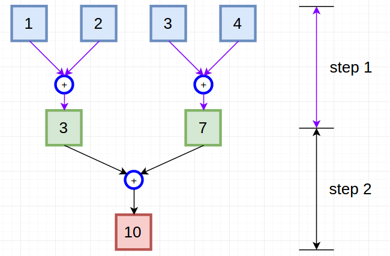
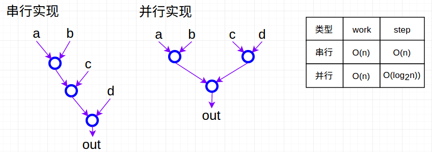
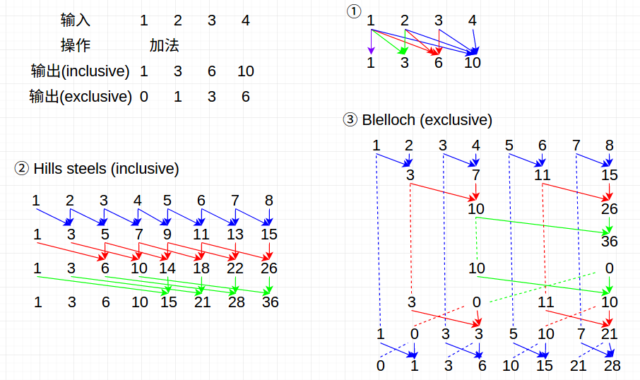
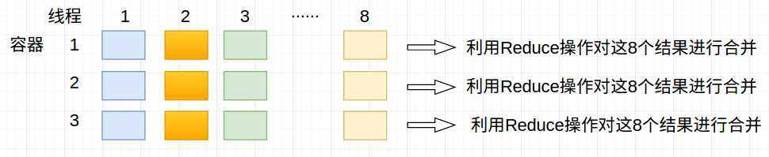

# GPU基础算法1

这一部分主要介绍三种：Reduce，Scan，Histogram

先引入两个概念：

① 工作量(work)：完成一个工作所需的“算术操作”数目

② 步数(step)：完成一个工作所需的步骤数

以下图为例，完成下述流程所需的“算术操作(+操作)”为3次，所需的步数为2步。即work=3, step=2



## 1. Reduce操作

输入： 

1. 一系列元素(如一个数组)
2. Reduction操作：需满足两个条件
   - 二元操作：a (op) b = out
   - 结合律： (a (op) b) (op) c =  a (op) (b (op) c)

串并行实现：



注：Reduce往往和共享内存结合来进一步提高执行速度。详细比较见code

## 2. Scan操作

输入：

1. 一系列元素(如一个数组)
2. 满足二元与结合律的操作 (操作必须存在单位元素，否则该操作不符合要求)
3. 单位元素I：即 I (op) a = a  

简单实例：（以加法操作为例，此外。后续两种实现采用8个数字的长度，更容易看出具体实现步骤）



上述三种实现的步长和工作量：

|  类型  |    方法①    |    方法②     |   方法③   |
| :--: | :-------: | :--------: | :-----: |
| work |  O(n^2)   | O(nlog(n)) |  O(n)   |
| step | O(log(n)) |   log(n)   | 2log(n) |

说明：

1. 方法① 中的step是与最大的Scan等价，可以视为n个不同长度的Scan操作的并行，因此步长等于最大Scan的步长

2. inclusive和exclusive两种情况是非常容易互相转化的，以下伪代码可以实现

   ```c
   /* inclusive版本 */
   int acc = identity;
   for(int i=0; i<elements.length(); i++)
   {
     acc = acc op element[i];
     out[i] = acc;
   }
   /* exclusive版本 */
   int acc = identity;
   for(int i=0; i<elements.length(); i++)
   {
     out[i] = acc;
     acc = acc op element[i];
   }
   ```

3. 关于方法②和方法③如何选择的问题：当我们拥有的线程数很多时(线程数>数据量)可以选择采用方法②， 当数据量更大时，可以选择方法③

4. 工作量比线程数多：选择work更高效的算法。 工作量比线程少：选择步数更高的算法

## 3. Histogram操作

输入：

1. 一系列元素
2. 一系列容器（每个元素属于这些容器中的其中一个）

输出：每个容器包含的元素数目

注：其实就是我们所知道的直方图。

**串行的伪代码：**

```c
/* 串行实现 */
for(i=0; i<BIN_COUNT; i++){
  result[i] = 0;
}
for(i=0; i<measurements.size(); i++){
  result[computeBin(measuremens[i])]++;
}
```

### 并行的实现

①：采用原子操作，伪代码如下所示

```c
/* 并行实现 */
__global__ void simple_histo(int *d_bins, const int *d_in, const int BIN_COUNT)
{
    int myId = threadIdx.x + blockDim.x * blockIdx.x;
    int myItem = d_in[myId];
    int myBin = myItem % BIN_COUNT;
    atomicAdd(&(d_bins[myBin]), 1);
}
```

注：这种方式适合容器数目比较大的时候，当容器非常少时，原子操作的效率是比较低的

②：采用局部内存

每个线程均对应一个容器数组，分别记录该线程处理的结果（即各个元素属于那个容器）。（由于单个线程不存在冲突的情况，因此无需采用原子操作）。

以128个元素，8个线程，3种容器为例：



注：

1. 这种方法比较适合容器数目比较少的情况
2. 还有一种是先进行排序，之后再进行Reduce操作
3. 上述例子中其实在合并阶段，会用到8次原子相加操作