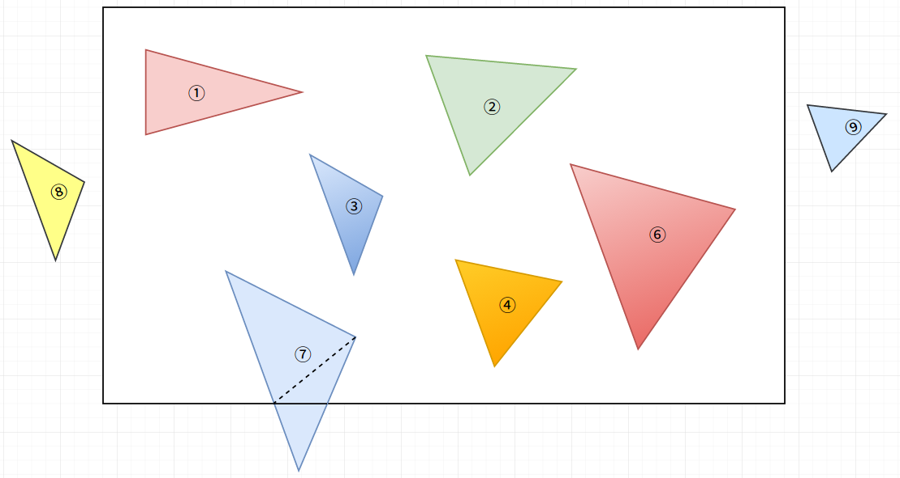
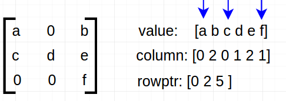
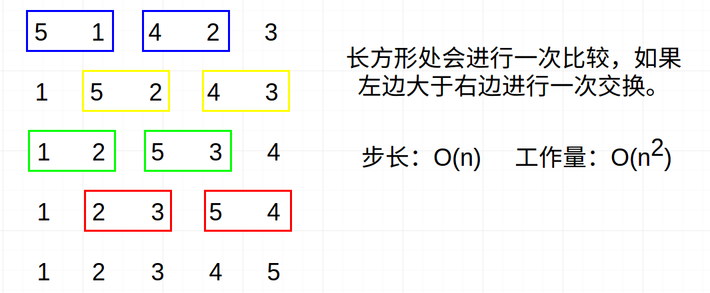
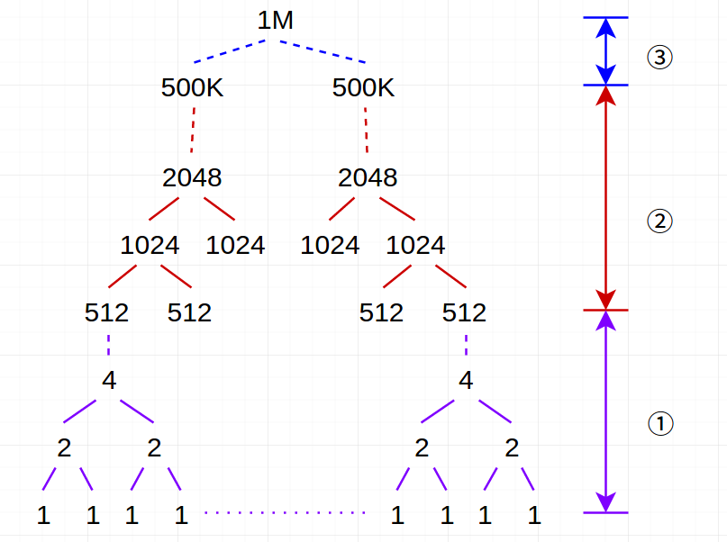
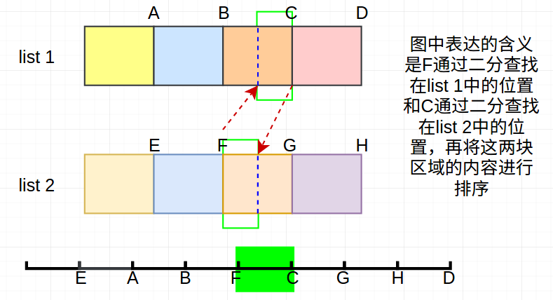
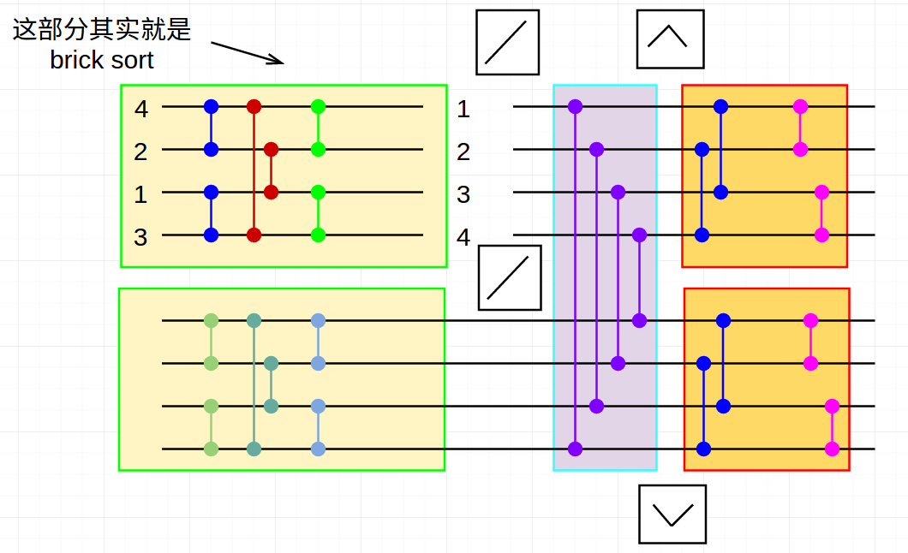

# GPU基础算法2

主要包含以下几部分内容：

- Compact
- allocate
- segmented scan
- sort

## 1. Compact

功能：从“庞大”的数据集中“筛选”出感兴趣(满足条件)的元素

具体形式如下（稠密版本的性能更佳）：

---

输入：          S0, S1, S2, S3, S4 ...

判别条件：    T,   F,    T,   F,   T  ...

输出：          S0  ---   S2  ---  S4  （SPARSE版本）

​           或者   S0, S2, S4              （Dense版本）

---

作用：使程序执行更高效，可以对比下面两种情况(只对纸牌中的方块进行处理：如果`compute_card`很耗时，则明显方法2更好)

```c
// method 1: formally launches 52 threads
if(card.isdiamond()==true)
{
  compute_card()
}
// method 2: the compute_card part only need 13 threads
cc = compact(card, isdiamond())  //52 threads
map(cc, compute_card())  // 13threads
```

Compact的流程：

1. 设立判别条件
2. 根据判别条件获得scan-in矩阵： 即每个元素在判别条件中为true(1)或false(0)
3. 对scan-in矩阵进行exclusive-sum-scan：获得“符合条件元素”的地址
4. 利用地址返回满足条件的元素作为输出

简单的实例：

```c
struct is_even {
    __host__ __device__

    bool operator()(const int x) {
        return (x % 2) == 0;
    }
};

const int N = 6;
int V[N] = {-2, 0, -1, 0, 1, 2};
int result[4];
copy_if(V, V + N, result, is_even());
// result = {-2, 0, 0, 2}
for(int i=0; i<4; i++)   
	std::cout << result[i] << std::endl;  
```

## 2. Allocate

针对Compact判断之后结果并不仅仅只占据一个位置的情况，以下面这种情况为例：


上述这种情况Compose在方块内的所有三角形，但是⑦就属于“特例”(一部分在其中，另一部分不在里面)，如果采取的策略是将里面的部分划分成多块三角形(如⑦划分为2个三角形)，此时的每个元素占据位置的数据就存在不均匀了。

常用的策略如下：

输入：每个输入元素在判别条件下占据的“空间”大小

输出：输入元素在输出元素中的位置

例如下述简单的例子(1代表占据一个位置，2代表占据两个位置。out代表在输出数组中的位置)：

IN:         1  0  1  2  1  0  3  0

OUT:     0  1  1  2  4  5  5  8   (利用Scan就能得到)

## 3. Segmented Scan

与Scan的区别在于：将原本输入数组划分成多个小片段，再对每个小片段进行Scan操作，结合header就可以和全段Scan的效果一样，下面的简单例子说明Segmented Scan是如何操作的：

```c
(1 2 3 4 5 6 7 8) ---> (0 1 3 6 10 15 21 28)  // exclusive sum scan
(1 2|3 4 5|6 7 8) ---> (0 1|0 3 7|0 6 13)     // segment scan
(1 0 1 0 0 1 0 0)     // header: 1 represent begin
```

## 4. SpMV 

SpMV (sparse matrix * vector)：稀疏矩阵与稠密向量的乘积操作

### 稀疏矩阵的另一种表示



其中value代表“有内容”的元素，column代表每个元素所在的列，rowptr代表每一行起始元素在value中的下标

### SpMV执行的步骤

以上述矩阵与[x, y, z]向量相乘为例

```c
[a b|c d e|f]        // 1. create sequenced represent from value+rowptr
[x z x y z z]        // 2. gather vector values using column
[ax bz|cx dy ez|fz]  // 3. pairwise multiply
// 4. exclusive segmented sum scan
out[0] = [ax+bz]; out[1] = [cx+dy+ez]; out[2] = [fz]
```

## 5. Sort

实现高效并行排序算法遵从的几个原则：

- 充分利用多线程（使GPU利用率高）
- 限制分支发散现象
- 尽可能的读写连续内存空间

下述主要介绍几种常见的并行排序方法（注：高效的串行排序算法并不一定能够转换为高效的并行程序）

### 5.1 Odd-Even Sort (也称为Brick Sort)



其中最长步长出现在最大数在最左边，此时就需要进行n次。“op”操作需要执行的次数可以视为$n/2*n=n^2/2$

### 5.2 Merge Sort



注：上图中的数字代表数组(或者序列)的长度，不代表具体的值。 步长：O(logn)，工作量：O(nlogn)

将整个merge sort分为三个阶段，各阶段特点不同：

①： 大量任务，每个任务又很小（如最底层就是两个数的排序），采用的策略---为每个任务分一个线程

②：一些任务，每个任务规模一般，采用的策略---为每个任务分配一个线程块

③：单个大任务（将两个排列的数组组合成一个），采用的策略---将任务分解成在多个流处理器上处理(主要为了提高利用率，避免许多流处理器闲置)

---

②中单个任务采用的方式：

list 1:  1  3  12  28   ---> address:  0  1  2  3

list 2:  2  10  15  21 ---> address:  0  1  2  3

对list 1中每个元素在list 2中进行二分搜索，从而可知list 2中有几个元素在其前面，因此不难获取两个数组合并后的address。

③中单个任务采用的方式：



A-H均是表达各小段的末尾那个值的地址，最下面的坐标轴表示是这几个坐标位置值的排序结果，而针对相邻两坐标轴之间的内容采用的排序方式利用上图所示进行。

---

### 5.3 Sorting Networks

属于一种“无关排序算法”：即无论什么输入，排序算法均以完全相同的方式进行。

先介绍双调序列：最多只能改变方向一次的序列（单峰值或单谷值），例如：

① 12542 ：是     ② 75346：不是    ③ 13245：不是

具体实现如下所示（其中同种颜色可以并行进行：此外两个矩形框内的也能并行进行）



说明：通过中间情况后会产生两个双调序列，而对双调序列的处理是比较容易的。步长：log(n)，工作量：nlog(n)

### 5.4 Radix Sort(\*)

具体的步骤如下：

1. 将整数表示成二进制
2. 从最低有效位开始，针对该位进行排序(0, 1)，保持整体的顺序
3. 不断向前，针对下一位进行排序

例如：

> 0 --->  000  --- 000 --- 000 --- 000 --->0
> 5 --->  101  --- 010 --- 101 --- 010 --->2
> 2 --->  010  --- 101 --- 010 --- 101 --->5
> 7 --->  111  --- 111 --- 111 --- 111 --->7

说明：

1. 执行步数为k (k代表最大那个值的位数)  工作量为O(kn)
2. 在具体实现时，针对每一位进行操作时用到了Compact

