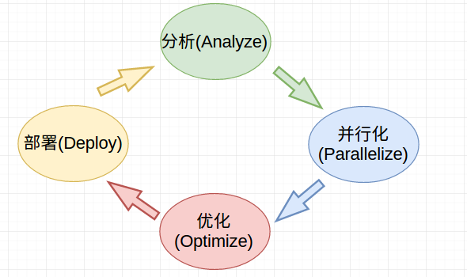
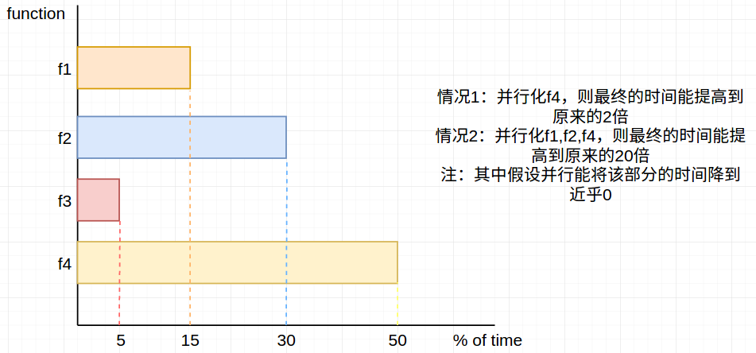
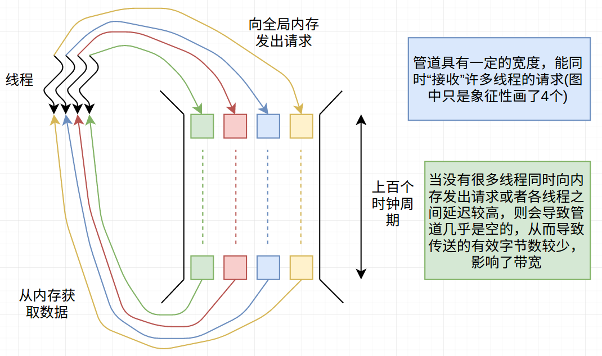
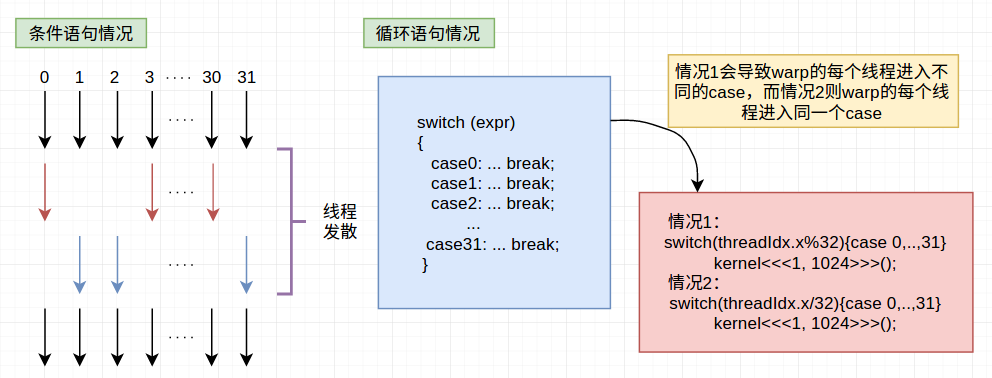
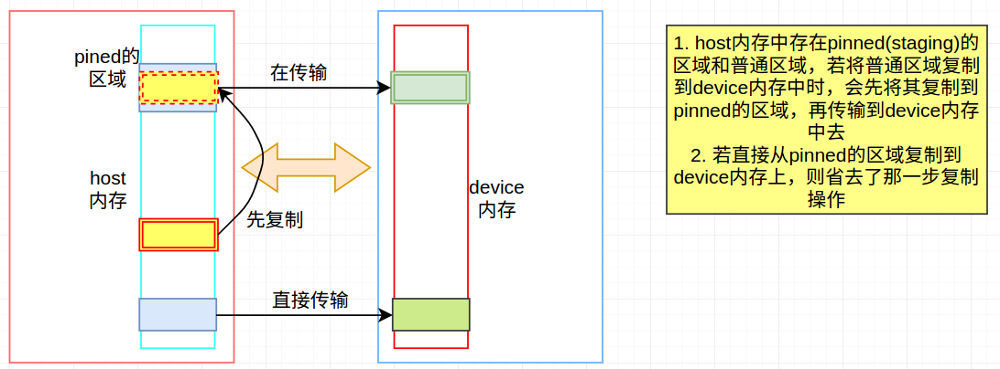
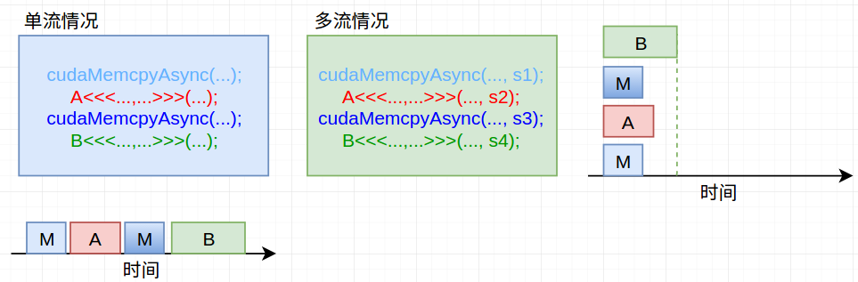
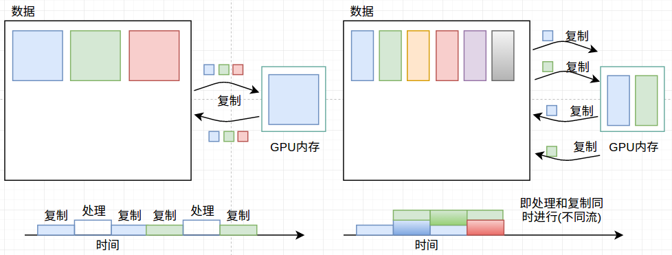

# 优化GPU程序

主要集中在：1. 使程序跑的更快   2. 能够解决更大的问题   3. 解决更多的问题。

编写高效GPU程序遵从的几个原则：

- 最大化算数密度
- 减少在内存读存操作上的时间开销
- 尽可能使内存空间连续
- 避免线程发散
- 将全局内存上面被频繁操作的数据移到共享内存上

## 1. 优化遵从的优先级

|        优先级         |           CPU例子            |       GPU例子        |
| :----------------: | :------------------------: | :----------------: |
|    1. 选择一个更佳的算法    | 使用归并排序O(nlogn)替代插入排序O(n^2) |    采用归并排序替代插入排序    |
| 2. 遵从编写高效程序的一些基本准则 |         更有效利用缓冲的代码         | 根据编写高效GPU程序遵从的介个原则 |
|   3. 基于体系结构进行优化    |   阻塞L1缓冲以及使用向量寄存器SSE,AVX   |  优化寄存器的使用，优化存储体冲突  |
|    4. 指令集操作的优化     |             略              |      使用浮点不规范       |

注：程序员的工作主要是集中在前两个优化上面。此外，优先级3对于CPU程序影响较大，但对GPU程序影响往往不大

## 2. APOD：系统优化



1. 分析：分析整个应用程序，审视全局，观察此应用程序什么地方可以从并行化受益，以及可以获得预期的受益。（可给后面的优化和并行化提供方针）

2. 并行化：针对需并行化的代码
   选择最合适的方法：

   - 从一个已经实现此需求的GPU并行库中调用
   - 基于一些轻量级的库进行进一步改进
   - 实际编写一个并行的程序

   选择一种好的算法(\*)

3. 优化：基于分析，对2中的并行化进一步优化（这一步其实可以视为衡量2的实现好不好，有哪些地方可以改进之类的）--- 往往2,3交替迭代

4. 部署：部署到实际使用中去

---

一个串行程序解决一个规模大小为P的问题需要T的时间（比如：1小时内能够处理问题A）

并行化的两种不同“方向”：

1. 弱缩放：在相同时间内处理问题的规模不同（比如：1小时内能够处理比A更大的问题或者1小时内能够处理多个小的问题）
2. 强缩放：处理相同的问题所需的时间更短（比如：1分钟之内就能够处理好A）

---

下面对各个部分再进一步解释

### 2.1 分析

分析主要集中在两部分：① 找出需要改进的“热点”区域  ② 理清问题具体是弱缩放问题还是强缩放问题

“热点”区域不能仅仅凭直觉，往往需要借助一些具体软件或测试，如下述的的简单例子：



此外，并行计算遵从阿姆达尔定律(Amdahl's Law)，即满足（$W_s$:只能串行部分运行时间，$W_p$能够并行部分运行时间：是指未并行前的时间，$p$处理器数量）：
$$
acc=\frac{W_s+W_p}{W_s+\frac{W_p}{p}}\ \ \ \ \ \ lim_{n\to\infty}acc=\frac{W_s+W_p}{W_s}
$$
上面的式子表面：加速比是有上限的。（上面的式子给出了我们能够达到的最佳情况）

### 2.2 并行化

这部分的一个简单实例：不同操作下转置操作的耗时（详见代码）

#### 带宽相关知识

先从查询GPU硬件信息开始，通过下面代码可以看到自己设备上GPU的信息（前提装了cuda example）

```shell
# goto the directory
cd NVIDIA_CUDA-8.0_Samples/1_Utilities/deviceQuery
# run this: if not compile, you need compile it first
./deviceQuery
```

此时会显示GPU的信息，下述只给出几个比较关键的参数信息：

```c
CUDA Capability Major/Minor version number:    3.0         // 这部分和你选择arch和code时有关
( 8) Multiprocessors, (192) CUDA Cores/MP:     1536 CUDA Cores  // 拥有的cuda核心数
Memory Clock rate:                             3505 Mhz   // 时钟频率
Memory Bus Width:                              256-bit    // 总线宽度
```

理论峰值带宽=时钟频率×总线带宽=$(3505*10^6)*(256/8/1024/1024)\simeq104.457(GB/s)$

某个kernel的实现占用的带宽=元素数目×单元素占据的字节数x通过总线的次数

下述给出不同方式处理转置(矩阵大小=1024x1024)时的情况

|    版本    |  运行时间   |   核占用的带宽   | DRAM使用率 |
| :------: | :-----: | :--------: | :-----: |
|  v1：串行   | 466 ms  | 0.018 GB/s |  <0.1%  |
| v2：按行并行  | 4.7 ms  |  1.8 GB/s  |  1.8%   |
| v3：按元素并行 | 0.67 ms | 12.5 GB/s  | 11.97%  |

说明：

1. DRAM使用率越高往往说明程序的效率越好（充分利用了线程）
2. 真实情况下，我们往往运行nvvp(terminal中输入nvvp即可打开)来测试一个可执行程序各个函数及内核的运行时间和DRAM使用率等，而不是向上述这样通过“手算”（打开时请将 Enable unified memory profile的勾勾去掉），或者直接命令行运行`nvprof --unified-memory-profiliy off ./执行文件`，反正NVVP会给出很多建议，这些对我们改进程序很有用，推荐使用(\*)
3. DRAM使用率低往往是由于“内存”稀疏导致，从这方面入手一般都能进行一些改进。(尽可能减少stride)

#### 利特尔法则（Little's Law）

传送的有效字节数(useful bytes delivered) = 平均延时(average latency)×带宽(bandwidth)  ： 即带宽收到传送的有效字节数和平均延时的影响。

---

存在一个最小延迟：把一个信号或一块数据从一个SM一直移动DRAM的某处，或从DRAM获取信息并带入SM，需要经过上百个时钟周期

这就说明了：试图读写全局内存的线程需要等待上百个时钟周期的时间，这也是为什么很多线程同时运行是，一个线程向全局内存请求一块数据，而其他一些线程在进行一些计算。

---

① 传送的有效字节数



所以一般要求线程数不能太少，以及避免线程发散的情况

②  平均延迟

降低平均延迟的方法：1. 减少每个块中的线程数（这可以减少“同步”所需的时间：看具体问题）  2. 增加每个流处理器上块的数目

#### 占用率

主要考虑四个指标(均指单个SM上的情况)：

- thread blocks : 8个
- threads/per SM：2048
- registers for all threads：65536
- bytes of shared memory：49152(往往是16K~48K之间)

可以分析程序具体是因为这四个指标中的哪一个"过快超标"，并改进此问题

## 3. 优化计算性能

目标：最大化有效计算效率

- 最小化“同步屏障”的等待时间（这部分此处不介绍）
- 最小化线程发散（\*）

### 3.1 最小化线程发散

先了解三个名词概念：

warp：同一时间执行相同指令的线程数（可以理解为同时执行一段代码）  （一般为32）

SIMD：single instruction，multiple data

SIMT：single instruction，multiple thread

注：一般都是将相邻的32个线程作为一个warp，warp这个概念很重要

线程发散往往出现在判断和循环语句中：



所以在使用到循环和条件语句的地方要留意一下是否存在线程发散的情况。

## 4. 配合数学优化 

1. 当且仅当你需要使用到双精度类型时才使用它，因为耗时方面：
   fp64>fp32     例如：float a=b+2.5 > float a=b+2.5f
2. 使用一些固有的函数：如\_\_sin()，\_\_cos()，\_\_exp()    虽然这些函数没有math.h精度高，但更快

## 5. Host-GPU之间相互通信

GPU和CPU之间的通信是通过PCIe总线进行的，传输速度大约在6GB/s

将CPU的内存“转移到”GPU内存的一般流程：


可以通过`cudaHostMalloc()`: 优先分配pinned的内存 和`cudaHostRegister()`: 将该部分内存置为pinned。此外，pinned的部分往往和`cudaMemcpyAsync()`配合使用

## 6. 流(streams)

stream：在GPU上按顺序执行的一系列操作（但可以不止一个stream）

```c
cudaStream_t s1;  // 定义一个流
cudaStreamCreate(&s1);  // 新建一个流
cudaStreamDestroy(s1);  // 销毁一个流
```

多流的好处：

- 重叠数据传输和计算（即一部分流在读写，另一部分流在计算）
- 同时在GPU上异步启动多个内核，从而可以用较小的kernel填满GPU
- 更多细节和好处可以参考：CUDA Programming Guide：stream and events

“多流”带来的效益 ①：



可以看到多流能够提高效率

“多流”带来的效益②（当GPU内存不够用时）：




