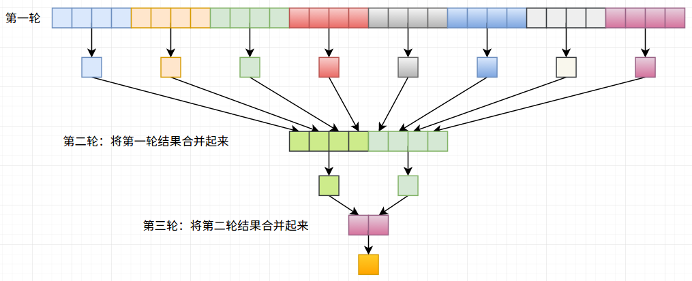

# 色彩均衡化(未完成)


## 1. 内核函数

### 1.1 RGB=>xyY内核

将RGB转为亮度情况的色系

```c
__global__ void rgb_to_xyY(float *d_r, float *d_g, float *d_b, float *d_x,
        float *d_y, float *d_log_Y, float delta, int num_pixels_y, int num_pixels_x) {
    int ny = num_pixels_y;
    int nx = num_pixels_x;
    int2 image_index_2d = make_int2((blockIdx.x * blockDim.x) + threadIdx.x, (blockIdx.y * blockDim.y) + threadIdx.y);
    int image_index_1d = (nx * image_index_2d.y) + image_index_2d.x;

    if (image_index_2d.x < nx && image_index_2d.y < ny) {
        float r = d_r[image_index_1d];
        float g = d_g[image_index_1d];
        float b = d_b[image_index_1d];

        float X = (r * 0.4124f) + (g * 0.3576f) + (b * 0.1805f);
        float Y = (r * 0.2126f) + (g * 0.7152f) + (b * 0.0722f);
        float Z = (r * 0.0193f) + (g * 0.1192f) + (b * 0.9505f);

        float L = X + Y + Z;
        float x = X / L;
        float y = Y / L;

        float log_Y = log10f(delta + Y);

        d_x[image_index_1d] = x;
        d_y[image_index_1d] = y;
        d_log_Y[image_index_1d] = log_Y;
    }
}
```

### 1.2 获得一张图片中的最大和最小值

主要原理如下图所示：（同种颜色代表在同一个线程块中进行，而一个块中获取最小值的方式是采用操作为min或者max的Reduce的方式）



```c
__global__ void reduce_minmax_kernel(const float *const d_in, float *d_out, const size_t size, int minmax) {
    extern __shared__ float shared[];

    int mid = threadIdx.x + blockDim.x * blockIdx.x;
    int tid = threadIdx.x; // 每个块中的线程

    // we have 1 thread per block, so copying the entire block should work fine
    // 将整个图片移到共享内存上来
    if (mid < size) {
        shared[tid] = d_in[mid];
    } else {
        if (minmax == 0)
            shared[tid] = FLT_MAX;
        else
            shared[tid] = -FLT_MAX;
    }

    // wait for all threads to copy the memory
    __syncthreads();

    // 对超出部分的线程, 将其out置为无穷大或无穷小
    // don't do any thing with memory if we happen to be far off ( I don't know how this works with
    // sync threads so I moved it after that point )
    if (mid >= size) {
        if (tid == 0) {
            if (minmax == 0)
                d_out[blockIdx.x] = FLT_MAX;
            else
                d_out[blockIdx.x] = -FLT_MAX;

        }
        return;
    }

    // 对过各自块进行reduce操作
    for (unsigned int s = blockDim.x / 2; s > 0; s /= 2) {
        if (tid < s) {
            if (minmax == 0) {
                shared[tid] = min(shared[tid], shared[tid + s]);
            } else {
                shared[tid] = max(shared[tid], shared[tid + s]);
            }
        }

        __syncthreads();
    }

    if (tid == 0) {
        d_out[blockIdx.x] = shared[0];
    }
}
```

对上述内核进行不断迭代才有图中的类似效果，一次内核可以看成图中的一轮结果

### 1.3 直方图内核

获取该幅图片的直方图统计情况

采用原子加(atomicAdd)操作

```c
__global__ void histogram_kernel(unsigned int *d_bins, const float *d_in, const int bin_count, 
                                 const float lum_min, const float lum_max, const int size) {
    int mid = threadIdx.x + blockDim.x * blockIdx.x;
    if (mid >= size)
        return;
    float lum_range = lum_max - lum_min;
    int bin = ((d_in[mid] - lum_min) / lum_range) * bin_count;

    atomicAdd(&d_bins[bin], 1);
}
```

### 1.4 Scan操作内核

下述采用的是Hillis Steels Scan方法(inclusive)

```c
__global__ void scan_kernel(unsigned int *d_bins, int size) {
    int mid = threadIdx.x + blockDim.x * blockIdx.x;
    if (mid >= size)
        return;

    for (int s = 1; s <= size; s *= 2) {  // 间隔为1,2,4,8...2^k
        int spot = mid - s;  // 寻找与当前线程间隔为s的值

        unsigned int val = 0;
        if (spot >= 0)
            val = d_bins[spot];  // 将与当前值相隔s的置于val中
        __syncthreads();
        if (spot >= 0)
            d_bins[mid] += val;  // 当前值与间隔s处的值相加
        __syncthreads();

    }
}
```


### 1.5 归一化内核

将累积分布函数最大值限定为1.0（将之前每个值除以最后那个值即可）

```c
__global__ void normalize_cdf(unsigned int *d_input_cdf, float *d_output_cdf, int n) {
    const float normalization_constant = 1.f / d_input_cdf[n - 1];

    int global_index_1d = (blockIdx.x * blockDim.x) + threadIdx.x;

    if (global_index_1d < n) {
        unsigned int input_value = d_input_cdf[global_index_1d];
        float output_value = input_value * normalization_constant;

        d_output_cdf[global_index_1d] = output_value;
    }
}
```


